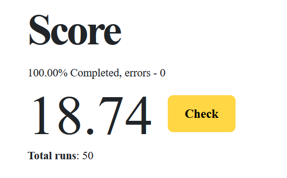

# Introduction to C# and the .Net Platform (True Engineering)
# WormsApplication

## Task 1. World of worms

Worms live in a two-dimensional infinite world. A worm is a dot in this world. Life lasts 100 moves.

Interaction of the world and the worm:
1. The simulator asks the i-th worm what it is going to do.
2. The worm can answer:
a. Move (right, left, up, down)
b. Nothing
3. If the target cell is occupied (by another worm), then everything remains in its place (the move is spent).
4. If the move is valid, then the worm moves in the right direction.

Initially, the world is inhabited by a worm at the point (0, 0). Implemented worm movement clockwise around the point (0,0).

As a result, a .Net Core console application was obtained, after launching which, a file of the following format should be generated.

Worms: [John (-1, 0)]
Worms: [John (-2, 0)]
…
Worms: [John (-10, 0)] 

## Task 2. World of worms, part 2. (food, reproduction).

The worm's vitality parameter is added. Each turn, the worm's life force is reduced by 1, the worm with 0 life force is removed from the world.

At the beginning of the turn, before the move of all the worms, a portion of food appears in an empty place.

Free space is defined as follows:

* Each coordinate (x,y) is generated by entering a random value normally distributed on the set of integers [int]*.

* Probability of dropping i value, normally distributed with standard deviation 5 (*) and mean value 0*

* If the point (x,y) is occupied by another portion of food, then a new generation of a random point occurs until an empty place is found.

* If the point (x,y) is occupied by a worm, then the worm "eats" it at the beginning of its turn (then it can move to another cell and eat another portion)

* Food exists in the world for exactly 10 turns (including the turn on which it appears), on the 11th move the food is removed from the world "rotten". Food increases the worm's vitality by 10.

A worm can multiply by division, for this:
direction (up, down, right, left)
if the point in the specified direction is free, then a new worm with a new unique name does not appear in it.

Interaction of the world and the worm:
1. The simulator asks the i-th worm what it is going to do.
2. The worm can answer:
a. Move (right, left, up, down)
b. Multiply by pointing direction (right, left, up, down)
c. Nothing (turn spent)
3. If nothing, then everything remains in its place.
4. If the worm wants to move,
a. The target point is occupied (by another worm), then everything remains in its place.
b. The target point is free, then the worm moves to the free space.
c. The target point is occupied by a portion of food, then the worm "eats it", the worm's vitality is increased by 10, the food is removed from the world.
5. If the worm wants to breed
a. If the worm's life force is 10 or less, then nothing happens (the turn is spent).
b. The target cell is occupied by another worm, then nothing happens (the move is spent).
c. The target cell is occupied by food, then nothing happens (the move is spent).
d. The target cell is free, a worm spawns on it, with a life force of 10 and a unique name, the life force of the original worm is reduced by 10.

Initially, the world is inhabited by a worm at the point (0, 0). The movement of the worm to the nearest portion of food has been implemented.

As a result, a .Net Core console application was obtained, after launching which, a file of the following format should be generated.

Worms: [John-23 (-1, 0)], Food: [(1.1), (1.1), (1.1)]
Worms: [John-22 (-2, 0)], Food: [(1.1), (1.1), (1.1)]
…
Worms: [John-1 (-10, 0)], Food: [(1.1), (1.1), (1.1)] 

## Task 3. (DI Container)

The simulator runs as a .Net Generic Host as a Hosted service.

Implemented as separate services.
* Food generator.

* Worm name generator.

* The logic of the action of the worm.

* Service for recording a report from the actions of the worm in a file.


## Task 4. Tests.
Implemented tests that check the following:
* Interaction between simulator and worm

* Motion
     * On an empty cell

     * Cage with food, and increase vitality

     * Occupied cell

* Reproduction

     * successful attempt

     * unsuccessful attempt

* The uniqueness of the names of worms during generation

* Food generation:

     * The uniqueness of the points at which food appears.

     * Generation of food in a cage in which the worm is already present.

* The logic of the action of the worm (movement to the nearest portion) 

## Task 5. Preservation of the behavior of the world.
The behavior of the world is at what points the portions of food appear on each turn. The behavior has a name, a set of points, and numbers of moves in which portions of food appear.

* Behavior is generated by name.
* The simulator reads the behavior of the world, and performs the life of worms in it.
* The database stores several behaviors with unique names.

The result is a console application that needs to pass the name of the behavior as a parameter. Console application generates behavior and stores it in POSTGREE database

The simulator reads the behavior passed as a parameter, and the worm from task 2 must live in the world with the given behavior.

Test coverage done using EF In-Memory:
* World behavior generation
* Readings of the behavior and actions of the worm in the world with predefined behavior

## Task 6. Optimal behavior.

The logic of the worm's actions is implemented as a web service running in a docker container.

Simulator:

* Accesses a web service,

* Makes a request for the behavior of the worm.

Request Format

POST /John/getAction?step=2&run=3
```json
{
   "worms": [
     {
        "name": "john",
        "lifeStrength": 14,
        "position": {
         "x": -2,
         "y": 0
       }
     }
   ],
   "food": [
     {
       "expiresIn": 4,
       "position": {
         "x": 7
         "y": -6
       }
     },
     {
       "expiresIn": 5,
       "position": {
         "x": -4,
         "y": -3
       }
     }
   ]
}
```
Response format:

{ direction: "Up", split: true }

**On the hundredth move, an average of 18 worms is obtained. Sandbox tested: https://sites.google.com/d/1ryKDnRZGG9D8LgloNvKsPly2z5WTWqUX/p/1Dfh44mCR9fAXGJGCQ0css2K2Z07R9PIB/edit**


